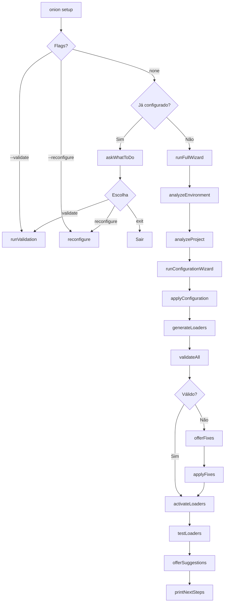

# Comando `onion setup` - Guia Completo

## 📋 Visão Geral

O comando `onion setup` é um wizard inteligente de configuração pós-inicialização que guia o usuário através da validação, configuração e ativação completa do Onion v4.

## 🎯 Objetivo

Após executar `onion init`, o usuário precisa de um comando que:
- ✅ Valide o ambiente e configurações
- ✅ Detecte automaticamente stack e IDEs
- ✅ Sugira contextos apropriados
- ✅ Configure integrações
- ✅ Ative loaders de IDE
- ✅ Teste tudo e garanta funcionamento

## 🚀 Uso Básico

### Primeira Configuração

```bash
cd meu-projeto
onion init
# ... selecionar opções básicas ...

onion setup
# Wizard completo de configuração
```

### Validação de Configuração Existente

```bash
onion setup --validate
# ou
onion validate
```

### Reconfiguração

```bash
onion setup --reconfigure
```

### Forçar Wizard Completo

```bash
onion setup --force
```

## 📦 Funcionalidades

### 1. Análise de Ambiente

Detecta automaticamente:
- Node.js (verifica v18+)
- Package manager (npm/pnpm/yarn)
- Git
- IDEs instaladas (Cursor, Windsurf, Claude Code)

```
━━━━━━━━━━━━━━━━━━━━━━━━━━━━━━━━━━━━━━━
📊 Análise de Ambiente
━━━━━━━━━━━━━━━━━━━━━━━━━━━━━━━━━━━━━━━

Ambiente de Desenvolvimento:
  ✅ Node.js v20.10.0
  ✅ pnpm 8.15.0
  ✅ Git 2.42.0

IDEs Detectadas:
  ✅ Cursor (/home/user/.cursor)
```

### 2. Análise de Projeto

Detecta automaticamente:
- Tipo de projeto (startup/enterprise/open-source/agency)
- Framework (React, Next.js, Vue, etc)
- Stack (JavaScript, TypeScript, Python)
- Monorepo (NX, Lerna, pnpm workspaces)
- CI/CD configurado
- Docker
- Múltiplas equipes

```
━━━━━━━━━━━━━━━━━━━━━━━━━━━━━━━━━━━━━━━
🔍 Análise de Projeto
━━━━━━━━━━━━━━━━━━━━━━━━━━━━━━━━━━━━━━━

Projeto Detectado:
  Nome: meu-projeto
  Tipo: startup
  Framework: Next.js
  Stack: JavaScript/TypeScript

Características:
  ✅ Monorepo
  ✅ CI/CD configurado
  ✅ Docker
  ➖ Múltiplas equipes
```

### 3. Wizard Interativo

#### 3.1 Confirmação de Tipo de Projeto

```
? Detectamos um projeto startup. Está correto? (Y/n)
```

Se não:
```
? Selecione o tipo de projeto:
  🚀 Startup - Produto em desenvolvimento rápido
  🏢 Enterprise - Empresa com múltiplas equipes
  📖 Open Source - Projeto de código aberto
  🎨 Agency - Agência desenvolvendo para clientes
  ⚙️  Custom - Configuração personalizada
```

#### 3.2 Seleção de Contextos (com Sugestões)

```
💡 Contextos sugeridos para seu projeto:

  ✅ Business Context
     Gestão de produto, estratégia e roadmap

  ✅ Technical Context
     Desenvolvimento, arquitetura e documentação técnica

  ✅ Customer Success Context
     Startups se beneficiam de foco em sucesso do cliente

? Selecione os contextos a ativar: (Use setas e espaço)
 ◉ Business Context (recomendado)
 ◉ Technical Context (recomendado)
 ◉ Customer Success Context (recomendado)
 ◯ DevOps Context
 ◯ Architecture Context
```

**Sugestões Inteligentes:**

| Tipo de Projeto | Contextos Sugeridos |
|-----------------|---------------------|
| Startup | business, technical, customer-success |
| Enterprise | business, technical, team, architecture |
| Open Source | business, technical, community |
| Agency | business, technical, team |

**Baseado em Características:**

| Característica | Contexto Sugerido |
|----------------|-------------------|
| Monorepo | architecture |
| CI/CD ou Docker | devops |
| Múltiplas equipes | team |

#### 3.3 Seleção de IDEs (com Detecção)

```
🖥️  IDEs detectadas no sistema:

  ✅ Cursor (/home/user/.cursor)

? Selecione as IDEs a configurar:
 ◉ Cursor (detectada)
 ◯ Windsurf
 ◯ Claude Code
```

#### 3.4 Integrações (Opcional)

```
? Deseja configurar integrações externas (ClickUp, GitHub, etc)? (y/N)

? Selecione as integrações:
 ◯ ClickUp - Task Management
 ◯ GitHub - Version Control
 ◯ Slack - Notifications
```

#### 3.5 Resumo e Confirmação

```
━━━━━━━━━━━━━━━━━━━━━━━━━━━━━━━━━━━━━━━
📋 Resumo da Configuração
━━━━━━━━━━━━━━━━━━━━━━━━━━━━━━━━━━━━━━━

  Tipo: startup
  Contextos: business, technical, customer-success
  IDEs: cursor
  Integrações: clickup, github

? Confirma a configuração? (Y/n)
```

### 4. Aplicação de Configurações

```
━━━━━━━━━━━━━━━━━━━━━━━━━━━━━━━━━━━━━━━
🔧 Aplicando Configurações
━━━━━━━━━━━━━━━━━━━━━━━━━━━━━━━━━━━━━━━

  ✅ .onion-config.yml atualizado
  ✅ Diretórios criados
```

### 5. Geração de Loaders

```
━━━━━━━━━━━━━━━━━━━━━━━━━━━━━━━━━━━━━━━
🚀 Gerando IDE Loaders
━━━━━━━━━━━━━━━━━━━━━━━━━━━━━━━━━━━━━━━

✔ Created cursor loader
✔ Loaders gerados com sucesso!
```

### 6. Validação Final

```
━━━━━━━━━━━━━━━━━━━━━━━━━━━━━━━━━━━━━━━
✅ Validação Final
━━━━━━━━━━━━━━━━━━━━━━━━━━━━━━━━━━━━━━━

✅ Configuração validada com sucesso!
```

Se houver problemas:
```
⚠️  Alguns problemas foram detectados:

❌ Erros de IDE:

  1. .cursorrules não encontrado

🔧 Correções Disponíveis:

  1. Gerar .cursorrules automaticamente
     Será executado o loader do Cursor

? Deseja aplicar as correções automáticas? (Y/n)
```

### 7. Ativação

```
━━━━━━━━━━━━━━━━━━━━━━━━━━━━━━━━━━━━━━━
🎉 Ativação
━━━━━━━━━━━━━━━━━━━━━━━━━━━━━━━━━━━━━━━

🚀 Ativando IDE loaders...

  ✅ cursor ativado

  ✅ cursor: .cursorrules gerado
```

### 8. Próximos Passos

```
━━━━━━━━━━━━━━━━━━━━━━━━━━━━━━━━━━━━━━━
✅ Setup Concluído com Sucesso!
━━━━━━━━━━━━━━━━━━━━━━━━━━━━━━━━━━━━━━━

📋 Próximos Passos:

Cursor:
  1. Recarregue o Cursor (Ctrl+Shift+P → "Reload Window")
  2. Digite @ para ver agentes disponíveis
  3. Digite / para ver comandos disponíveis

🔧 Comandos Úteis:

  onion setup --validate      Validar configuração
  onion setup --reconfigure   Ajustar configurações
  onion add context           Adicionar novo contexto
  onion add ide               Adicionar nova IDE
```

## 🔍 Validação (`--validate`)

### Modo Apenas Validação

```bash
onion setup --validate
# ou
onion validate
```

#### O que é Validado:

1. **Ambiente de Desenvolvimento:**
   - Node.js v18+
   - Package manager (npm/pnpm/yarn)
   - Git instalado

2. **Configuração do Projeto:**
   - `.onion-config.yml` existe e é válido
   - Campos obrigatórios presentes
   - Diretórios `.onion/` existem

3. **Integração com IDEs:**
   - Loaders gerados
   - Arquivos de configuração (`.cursorrules`, `windsurf.config.yml`, etc)
   - Symlinks criados (para Cursor)

#### Saída de Validação:

```
🔍 Validando projeto...

📊 Relatório de Validação

Ambiente de Desenvolvimento:
  ✅ Ambiente válido

Configuração do Projeto:
  ✅ Configuração válida
  ⚠️  2 avisos

Integração com IDEs:
  ✅ IDEs configuradas

⚠️  Projeto com problemas. Veja detalhes abaixo.

⚠️  Avisos de Configuração:

  1. Campo "project.name" não definido
  2. Diretório .onion/contexts/ não encontrado

🔧 Correções Disponíveis:

  1. Criar estrutura de diretórios .onion/
     Serão criados: .onion/contexts/, .onion/ide/

? Deseja aplicar as correções automáticas? (Y/n)
```

## ⚙️ Reconfiguração (`--reconfigure`)

### Modificar Configuração Existente

```bash
onion setup --reconfigure
```

```
⚙️  Reconfiguração do Onion System

Configuração atual:
version: '4.0'
project:
  type: startup
  name: meu-projeto
contexts:
  - business
  - technical
ides:
  - cursor
integrations: {}

? O que deseja reconfigurar:
 ◯ Tipo de projeto
 ◉ Contextos
 ◉ IDEs
 ◯ Integrações
```

## 🏗️ Arquitetura Interna

### Módulos

```
src/commands/setup/
├── analyzers.js      # Análise de ambiente e projeto
├── validators.js     # Validação de configurações
├── wizard.js         # Wizard interativo
├── adjusters.js      # Correções automáticas
└── activators.js     # Ativação de loaders
```

#### `analyzers.js`

- `analyzeEnvironment()` - Detecta Node, package manager, Git, IDEs
- `analyzeProject()` - Detecta tipo, framework, stack, características
- `detectInstalledIDEs()` - Procura IDEs no sistema
- `printEnvironmentSummary()` - Formata output
- `printProjectSummary()` - Formata output

#### `validators.js`

- `isProjectConfigured()` - Verifica se `.onion-config.yml` existe
- `validateAll()` - Executa todas as validações
- `validateEnvironment()` - Valida Node, Git, package manager
- `validateProject()` - Valida `.onion-config.yml` e diretórios
- `validateIDEs()` - Valida loaders e configurações de IDE
- `printValidationSummary()` - Formata output
- `printValidationErrors()` - Formata erros e avisos

#### `wizard.js`

- `askWhatToDo()` - Menu inicial quando já configurado
- `runConfigurationWizard()` - Wizard completo
- `getSuggestedContexts()` - Gera sugestões inteligentes
- `applyConfiguration()` - Salva configuração em `.onion-config.yml`
- `reconfigure()` - Wizard de reconfiguração

#### `adjusters.js`

- `offerFixes()` - Detecta e oferece correções
- `applyFixes()` - Aplica correções automáticas
- `createDefaultConfig()` - Cria `.onion-config.yml` padrão
- `createDirectories()` - Cria `.onion/contexts/` e `.onion/ide/`
- `regenerateLoader()` - Regenera loader de IDE
- `suggestImprovements()` - Sugestões contextuais
- `offerSuggestions()` - Apresenta sugestões ao usuário

#### `activators.js`

- `generateLoaders()` - Gera loaders para IDEs configuradas
- `activateLoaders()` - Executa discovery e sync dos loaders
- `activateCursorLoader()` - Ativa loader Cursor
- `activateWindsurfLoader()` - Ativa loader Windsurf
- `activateClaudeLoader()` - Ativa loader Claude
- `testLoaders()` - Testa se loaders funcionam

### Fluxo de Execução



## 🧪 Testes

### Executar Testes

```bash
cd packages/onion-cli
node tests/integration/test-setup-command.js
```

### Cobertura de Testes

- ✅ Análise de ambiente e projeto
- ✅ Validação antes do setup
- ✅ Geração de loaders
- ✅ Ativação de loaders
- ✅ Validação após setup

## 💡 Exemplos de Uso

### Exemplo 1: Projeto Novo

```bash
# 1. Inicializar
onion init
# Selecionar: startup, business+technical, cursor

# 2. Configurar
onion setup
# Wizard detecta React, sugere customer-success
# Confirmar tudo → Loaders gerados → Tudo ativado

# 3. Recarregar Cursor
# Ctrl+Shift+P → Reload Window

# 4. Testar
# Digite @ → Ver agentes
# Digite / → Ver comandos
```

### Exemplo 2: Projeto Enterprise Existente

```bash
# 1. Migrar de v3
onion migrate

# 2. Configurar
onion setup
# Detecta: enterprise, NX, CI/CD, Docker
# Sugere: business, technical, team, architecture, devops
# Selecionar todas as sugestões

# 3. Validar
onion validate
# ✅ Tudo OK
```

### Exemplo 3: Validação e Correção

```bash
# 1. Validar
onion validate

# Output:
# ❌ Erros de IDE:
#   1. Loader para cursor não encontrado
# 
# ? Deseja aplicar as correções automáticas? (Y/n)

# 2. Aplicar correções
# Y

# Output:
# 🔧 Aplicando correções...
#   ✅ Loader cursor regenerado
# 
# ✅ Correções aplicadas!

# 3. Validar novamente
onion validate
# ✅ Projeto validado com sucesso!
```

## 🎯 Benefícios

1. **Zero Configuration Necessária**
   - Detecção automática de tudo
   - Sugestões inteligentes
   - Correções automáticas

2. **Experiência Guiada**
   - Wizard interativo
   - Explicações contextuais
   - Feedback visual constante

3. **Validação Completa**
   - Ambiente, projeto, IDEs
   - Avisos e erros claros
   - Correções oferecidas

4. **Ativação Automática**
   - Loaders gerados
   - Discovery executado
   - Testes finais

5. **Próximos Passos Claros**
   - Instruções por IDE
   - Comandos úteis
   - Sugestões contextuais

## 🔗 Comandos Relacionados

- `onion init` - Inicializa projeto Onion
- `onion add` - Adiciona contextos ou IDEs
- `onion migrate` - Migra de v3 para v4
- `onion validate` - Alias para `onion setup --validate`

---

**Versão:** 1.0.0  
**Última atualização:** 2026-01-01  
**Autor:** Onion System Team
